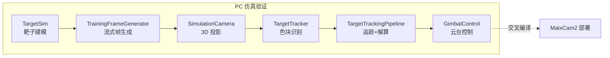
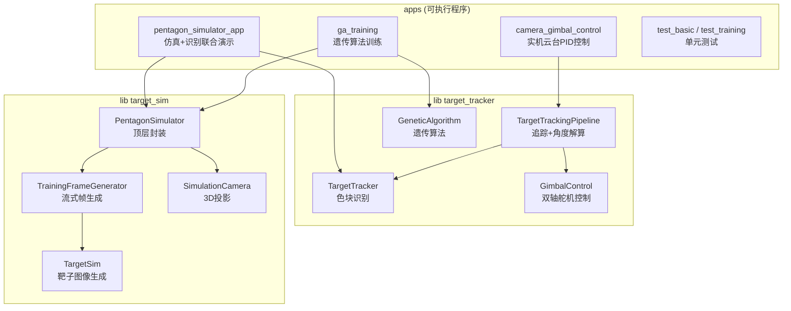
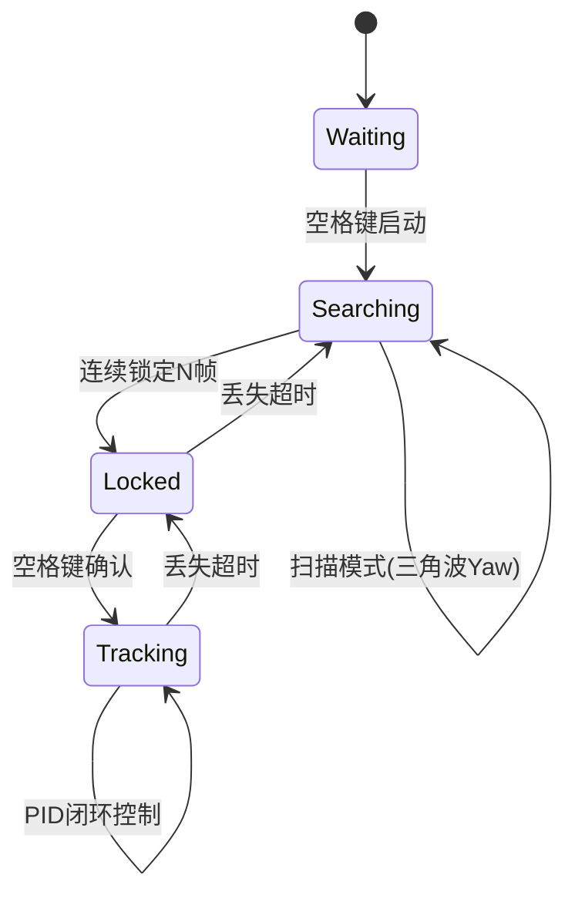

# MyGo Vision —— 靶子仿真、色块识别与云台控制

> **MyGo Vision** — 面向机甲杯赛事视觉模块的完整仿真-识别-控制闭环。从底层靶子建模到多色彩空间识别，从仿真相机投影到双轴 PID 云台控制，在 PC 端完成全链路仿真验证后，通过 MaixCDK 交叉编译部署至 MaixCam2 嵌入式平台。

[](https://en.cppreference.com/w/cpp/17)
[](https://opencv.org/)
[](https://cmake.org/)
[](LICENSE)
[](https://wiki.sipeed.com/maixcam/)

---

## 📖 项目简介

本项目围绕比赛视觉模块的核心需求，构建了 **"靶子仿真 → 图像识别 → 位姿解算 → 云台控制"** 完整闭环。项目采用 **高度解耦的分层架构**：仿真层 (`lib target_sim`) 与识别控制层 (`lib target_tracker`) 编译为独立库，仅通过 `cv::Mat` 接口传递数据，使得算法可在仿真中充分验证后，无缝迁移至嵌入式硬件。



### 🎯 覆盖的任务

| 任务 | 内容 | 对应模块 |
|------|------|----------|
| 任务一 | 目标色块识别 + 3D 仿真综合应用 | `PentagonSimulator` + `TargetTracker` |
| 任务二 | 相机图传与嵌入式部署 | MaixCam2 + MaixCDK |
| 任务三 | 目标坐标到角度解算 | `TargetTrackingPipeline` + `GimbalControl` |
| 任务四 | 靶子建模与仿真图像生成 | `TargetSim` + `SimulationCamera` |

---

## 🏗️ 项目架构

```
Mygo/
├── include/
│   ├── TargetSim/            # 仿真层头文件
│   │   ├── TargetSim.hpp              # 靶子图像生成
│   │   ├── TrainingFrameGenerator.hpp # 流式帧生成器
│   │   ├── SimulationCamera.hpp       # 3D仿真相机
│   │   ├── PentagonSimulator.hpp      # 顶层仿真封装
│   │   ├── Target3DGenerator.hpp      # 随机靶子+投影
│   │   └── PerformanceMonitor.hpp     # 帧率监控
│   └── TargetTracking/       # 识别控制层头文件
│       ├── TargetTracker.hpp          # 色块识别算法
│       ├── TargetTrackingPipeline.hpp # 追踪流水线
│       ├── GimbalControl.hpp          # 双轴云台控制
│       ├── SerialPort.hpp             # 串口通信
│       └── GeneticAlgorithm.hpp       # 遗传算法PID整定
├── src/
│   ├── TargetSim/            # 仿真层实现 (6个 .cpp)
│   ├── TargetTracking/       # 识别控制层实现 (4个 .cpp)
│   └── apps/                 # 可执行程序入口 (12个)
├── CMakeLists.txt            # 顶层构建配置
└── build/bin/                # 编译输出目录
```

### 分层依赖关系



---

## 🎨 仿真层

### 靶子建模 (`TargetSim`)

靶子由 **1 个中心色块 + 5 个外围色块** 组成五角星布局，共 12 种预定义 BGR 颜色。基于五角星顶点坐标精确计算外围色块位置，支持任意旋转角度。对外暴露 `get_blob_centroids()` 输出 Ground Truth，便于识别算法精度评估。

```cpp
// 核心接口
cv::Mat frame = target_sim.generate_pentagon_frame(
    center_position,   // 靶子中心像素坐标
    rotation_angle,    // 旋转角度 (弧度)
    &target_position   // 输出: 目标色块位置 (Ground Truth)
);
```

### 流式帧生成 (`TrainingFrameGenerator`)

4 种运动模式：五角星旋转、直线运动、随机位置出现、参数方程运动（圆周/正弦/李萨如）。通过 `std::function<float(float t)>` 注入角速度函数，模拟真实物理模型。内置帧率精确控制，仿真帧与真实时间对齐。

### 仿真相机 (`SimulationCamera`)

完整的针孔相机模型：

- **内参**: $f_x, f_y, c_x, c_y$ + 畸变系数 $k_1, k_2, p_1, p_2$
- **外参**: 6-DOF 位姿（位置 + 欧拉角）
- **投影链**: 世界坐标 → 外参变换 → 针孔投影 → 畸变模型 → 像素坐标

### 顶层封装 (`PentagonSimulator`)

整合靶子生成 + 相机投影，一行代码获取 3D 仿真图像：

```cpp
PentagonSimulator::CameraConfig config;
config.width = 640; config.height = 640;
config.fx = 381.625f; config.fy = 381.625f;  // 厂商内参
config.cx = 320.0f; config.cy = 320.0f;
config.position = cv::Point3f(0, -100, 1000); // 相机距靶 1m

PentagonSimulator simulator(config);
cv::Mat frame = simulator.get_frame(); // 即得 3D 投影仿真图像
```

**亮点**：能量机关角速度模拟 $a \cdot \sin(\omega t) + b$，双相机模型（俯视 + 前方），运行时交互调整视角，激光红点模拟。

---

## 🔍 识别算法

### 算法演进

| 版本 | 方法 | 改进 |
|------|------|------|
| V1 | 全图色块两两比较距离找中心 | 基础实现，O(n²) 复杂度 |
| V2 | 圆形度 (Circularity) 筛选 | 仅需 ~6 次比较即可确定中心 |
| V3 | HSV + LAB 色彩空间融合 | 解决深色/相近色误识别 |

### 多色彩空间自适应融合

对每个候选色块综合 **BGR 距离 + HSV 色调 + LAB 色差** 三维加权评分，根据中心颜色亮度自适应调整权重比例：

- **亮色中心**: 提高 BGR 权重，利用 RGB 三通道差异区分颜色
- **深色中心**: 提高 LAB 色差权重，利用亮度无关的色差信息区分暗色

结合 **Softmax 归一化**与**置信度比值门控**（最高分/次高分 ≥ 1.5×）筛选最终匹配。

### ROI 跟踪 + Kalman 滤波

```
全图检测 → 锁定靶子 → 初始化ROI窗口 → Kalman预测 → ROI内快速匹配 → 持续跟踪
                            ↑                                   |
                            └────────── 丢失超时回退 ───────────┘
```

锁定靶子后仅处理靶子周围 `±roi_padding` 区域，大幅降低后续帧开销。Kalman 滤波器提供运动预测，丢失计数器触发回退全图搜索。

---

## 🎮 控制层

### 追踪流水线 (`TargetTrackingPipeline`)



### 角度解算

利用相机内参将像素偏差转换为角度偏差：

$$\text{pitch\_error} = -\frac{y_{\text{target}} - c_y}{f_y} \qquad \text{yaw\_error} = \frac{x_{\text{target}} - c_x}{f_x}$$

### 双轴 PID 控制

独立 $K_p, K_i, K_d$ 参数，带积分限幅 (30°) + 输出限幅 (180°/s) + 微分低通滤波 + 死区 (8px)。

### 舵机协议

```
角度设定 → 零位修正 → PWM映射(500-2500μs) → 时间计算 → 协议打包 → 串口下发

协议格式: #001P1500T0500!#002P1500T0500!
```

### 遗传算法 PID 整定

在仿真环境中自动搜索最优 PID 参数（实验性功能）：

| 参数 | 默认值 | 说明 |
|------|--------|------|
| 种群大小 | 50 | 每代个体数 |
| 变异率 | 0.5 | 基因突变概率 |
| 变异幅度 | σ=0.3 | 高斯噪声标准差 |
| 最大代数 | 300 | 迭代次数上限 |
| 精英数 | 2 | 每代保留最优个体数 |

适应度评估：随机跳跃 + 正弦追踪 + 圆周追踪 + 李萨如轨迹，综合时间效率 $w_t$、跟踪误差 $w_e$、控制平滑度 $w_s$ 加权评分。

---

## 🚀 快速开始

### 环境要求

| 依赖 | 版本要求 |
|------|----------|
| CMake | ≥ 3.14 |
| C++ 编译器 | GCC 9+ / Clang 10+ (C++17) |
| OpenCV | ≥ 4.x (core, imgproc, highgui, video) |

### 安装 OpenCV

```bash
# Ubuntu / Debian
sudo apt install -y libopencv-dev

# macOS (Homebrew)
brew install opencv
```

### 构建

```bash
git clone https://github.com/AndyYang12345/MygoVison.git ~/Mygo
cd ~/Mygo

# 构建
mkdir -p build && cd build
cmake .. -DCMAKE_BUILD_TYPE=Release
make -j$(nproc)

# 所有可执行文件位于 build/bin/
ls build/bin/
```

### 可执行程序说明

| 程序 | 功能 | 依赖库 |
|------|------|--------|
| `test_basic` | 靶子图像生成测试 | `target_sim` + `target_tracker` |
| `test_training` | 识别算法单元测试 | `target_sim` + `target_tracker` |
| `test_single_image` | 单帧图片识别测试 | `target_tracker` |
| `test_threshold_tuner` | 色块阈值调节工具 | `target_sim` + `target_tracker` |
| `pentagon_3d_perspective` | 3D 投影效果演示 | `target_sim` + `target_tracker` |
| `pentagon_simulator_app` | **仿真+识别联合演示** | `target_sim` + `target_tracker` |
| `test_target3d_generator` | 随机靶子 3D 投影测试 | `target_sim` |
| `camera_canvas_demo` | 坐标 → 角度解算演示 | `target_sim` |
| `camera_gimbal_control` | **实机相机+云台 PID 控制** | `target_tracker` |
| `test_gimbal_control` | 云台控制单元测试 | `target_sim` + `target_tracker` |
| `test_gimbal_error_logger` | 云台误差记录与调试 | `target_tracker` |
| `ga_training` | 遗传算法 PID 整定训练 | `target_sim` |
| `ga_training_irl` | 遗传算法实机训练 | `target_tracker` |

### 快速体验

```bash
cd ~/Mygo/build/bin

# 体验靶子生成
./test_basic

# 体验 3D 仿真投影
./pentagon_3d_perspective

# 体验仿真+识别联合
./pentagon_simulator_app

# 体验角度解算
./camera_canvas_demo

# 体验云台控制 (需要连接串口舵机硬件)
./camera_gimbal_control
```

---

## 🧬 关键设计理念

### 仿真驱动开发

所有算法在实机部署前均可在 PC 端仿真环境中完成充分验证。仿真层从靶子几何建模到 3D 投影均独立实现，不依赖外部游戏引擎。同一套 C++/OpenCV 代码，PC 仿真验证后即可交叉编译至 MaixCam2。

### 高度解耦

- **仿真层** (`target_sim`) 与**识别控制层** (`target_tracker`) 编译为独立库
- 两层之间仅通过 `cv::Mat` 传递图像数据
- 仿真层可单独用于测试其他识别算法，识别层可单独连接真实相机
- 为后续 MaixCDK 交叉编译提供了清晰的移植路径

### 物理建模仿真

能量机关旋转曲线 $a \cdot \sin(\omega t) + b$、完整针孔相机投影链、6-DOF 外参模型——力求仿真行为贴近真实物理世界。

---

## 🔗 关联项目

| 项目 | 描述 | 仓库 |
|------|------|------|
| **MyGo ROS 上位机** | ROS 2 主控系统（状态机/手柄/MoveIt2） | [GitHub](https://github.com/AndyYang12345/mygo_ros.git) |
| **视觉模块嵌入式** | 基于 MaixCDK 的交叉编译部署 | [GitHub](https://github.com/AndyYang12345/mygo_via_maixcdk.git) |
| **个人博客** | 开发笔记与技术总结 | [Blog](https://andyyang12345.github.io/) |

---

## 📝 已知限制

- 识别算法在复杂光照环境下鲁棒性有待提升（深色/相近色仍有偶发误判）
- 遗传算法 PID 整定仅适用于仿真环境，实机调参仍需人工迭代
- 相机固连机械臂时外参难以精确标定，导致追踪精度下降
- 实机与仿真之间的 domain gap 需要更多在环测试来弥合

---

## 📄 许可

本项目基于 Apache 2.0 许可证开源。

---

*Made with ❤️ by MyGo Vision Team*