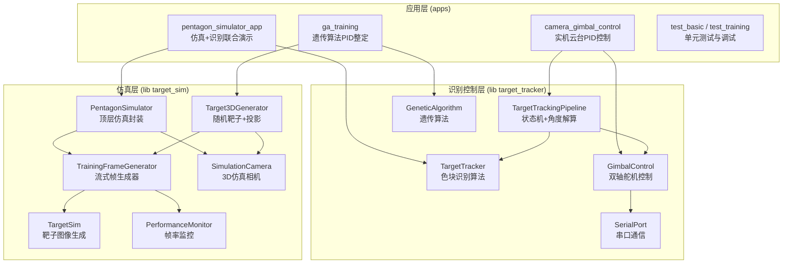
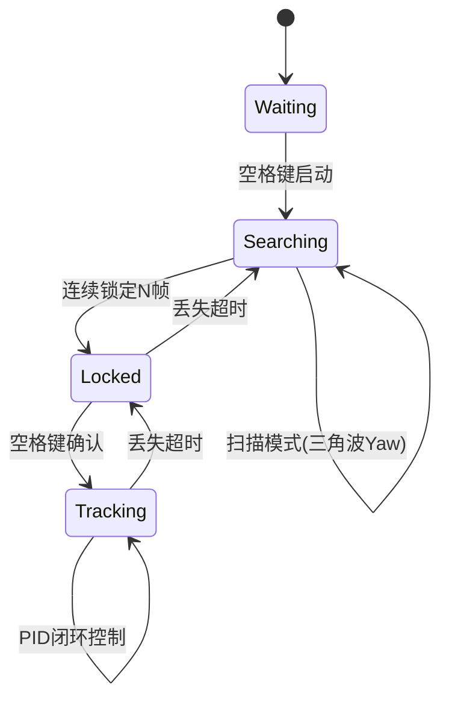

# Mygo 视觉项目技术总结

> **项目定位**：机甲杯（Myg0战队）视觉组 — 面向目标识别与云台控制的完整仿真-识别-控制技术链路  
> **作者**：视觉负责人 杨思源  
> **技术栈**：C++17 / CMake / OpenCV / 遗传算法 / PID控制 / 串口通信  
> **目标平台**：MaixCam2 (Linux + MaixCDK) + PC 仿真验证

---

## 一、项目概述

本项目围绕机甲杯赛事视觉模块的核心需求，构建了一条 **"靶子仿真 → 图像识别 → 位姿解算 → 云台控制"** 的完整闭环技术链路。项目采用高度解耦的分层架构，将仿真层与识别控制层完全分离，使得算法可在仿真环境中充分验证后，无缝迁移至嵌入式硬件平台（MaixCam2）。

### 核心任务覆盖

| 任务 | 内容 | 对应模块 |
|------|------|----------|
| 任务一 | 目标色块识别 + 3D仿真综合应用 | `PentagonSimulator` + `TargetTracker` |
| 任务二 | 相机图传与嵌入式部署 | MaixCam2 / MaixCDK |
| 任务三 | 目标坐标到角度的解算 | `TargetTrackingPipeline` + `GimbalControl` |
| 任务四 | 靶子建模与仿真图像生成 | `TargetSim` + `SimulationCamera` |

---

## 二、技术栈总览

| 层级 | 技术 | 说明 |
|------|------|------|
| 语言 | C++17 | 高性能核心算法实现 |
| 构建 | CMake >= 3.14 | 跨平台构建系统 |
| 视觉 | OpenCV (core, imgproc, highgui, video) | 图像处理、Kalman滤波、透视变换 |
| 优化 | 遗传算法（自实现） | PID参数自动整定 |
| 控制 | PID 控制器 | 双轴云台角度闭环控制 |
| 通信 | 串口 (termios) | 舵机PWM指令下发 |
| 硬件 | MaixCam2 + MaixCDK | 嵌入式视觉模块 |
| 数学 | 3D 旋转矩阵 / 射线-平面求交 | 空间投影与坐标变换 |

---

## 三、项目架构

项目分为三大模块层，构成清晰的分层依赖关系：



---

## 四、仿真层详解 — 从平面到3D的完整模拟

### 4.1 靶子建模：`TargetSim`

靶子由 **1个中心色块 + 5个外围色块** 组成五角星布局（共12种预定义BGR颜色）。核心能力：

- **精确几何建模**：基于五角星顶点计算5个外围色块坐标，支持任意旋转角度（弧度制）
- **颜色自动分配**：每次生成时随机选取中心颜色，外围颜色按预定义表排列，支持 `regenerate_colors()` 强制刷新
- **Ground Truth 输出**：对外暴露 `get_blob_centroids()` 提供所有色块的真实坐标，便于识别算法评估

```cpp
// 核心接口
cv::Mat frame = target_sim.generate_pentagon_frame(
    center_position,    // 靶子中心像素坐标
    rotation_angle,     // 旋转角度（弧度）
    &target_position    // 输出：目标色块位置（Ground Truth）
);
auto centroids = target_sim.get_blob_centroids(); // 6个色块真实坐标
```

### 4.2 流式帧生成：`TrainingFrameGenerator`

将静态靶子变为动态仿真流的核心引擎：

- **4种运动模式**：

  | 模式 | 说明 |
  |------|------|
  | `MODE_PENTAGON_ROTATION` | 五角星旋转模式，接受角速度函数驱动 |
  | `MODE_LINEAR_MOVEMENT` | 直线运动模式 |
  | `MODE_RANDOM_APPEARANCE` | 随机位置出现模式 |
  | `MODE_PARAMETRIC_MOTION` | 参数方程运动模式（支持圆周、正弦等） |

- **角速度函数注入**：通过 `std::function<float(float t)>` 实现物理模型注入
- **帧率精确控制**：内置时间戳管理，保证仿真帧与真实时间对齐

### 4.3 仿真相机模型：`SimulationCamera`

独立封装的3D相机投影模型，模拟真实相机成像过程：

- **内参模型**：支持 `fx, fy, cx, cy` 针孔模型参数 + `k1, k2, p1, p2` 畸变系数
- **外参模型**：相机位置 `(x, y, z)` + 欧拉角姿态 `(pitch, yaw, roll)`
- **透视投影**：世界坐标 → 图像坐标的完整变换链：`world_to_image()`
- **靶平面投影**：`project_training_frame()` 将 `TrainingFrameGenerator` 生成的2D靶平面图像投影到3D空间中
- **传感器参数**：`sensor_width/height` 用于毫米级精度建模

### 4.4 顶层仿真封装：`PentagonSimulator`

整合靶子生成与相机投影的一站式仿真接口：

```cpp
PentagonSimulator::CameraConfig config;
config.width = 640;  config.height = 640;
config.fx = 381.625f; config.fy = 381.625f;  // 厂商内参
config.cx = 320.0f;  config.cy = 320.0f;
config.position = cv::Point3f(0, -100, 1000);  // 相机距靶1米
config.pitch = 0.35f;  // 俯视角度

PentagonSimulator simulator(config);
cv::Mat frame = simulator.get_frame();  // 即得3D投影仿真图像
```

**特殊亮点**：

- **能量机关角速度模拟**：使用 $a \cdot \sin(\omega t) + b$ 的物理模型生成符合比赛的旋转速度曲线，参数在合理范围内随机采样
- **双相机模型**：内部维护源相机（俯视靶平面）和观察相机（前方视角），通过透视变换实现视角切换
- **交互控制**：支持运行时调整相机 pitch/yaw、暂停/继续动画
- **激光红点模拟**：可配置激光发射器偏移量和光斑半径，在投影图像上叠加激光点

### 4.5 随机靶子+投影：`Target3DGenerator`

专为遗传算法训练设计的模块。将 `TrainingFrameGenerator`（随机靶子模式）与 `SimulationCamera` 组合，按时间间隔自动刷新靶子位置和颜色，输出3D投影后的帧。也支持激光红点模型的叠加。

---

## 五、识别算法详解 — 多色彩空间融合 + ROI跟踪

### 5.1 核心流程

```
输入帧 → 色块提取(extract_color_blobs)
       → 中心色块定位(find_center_blob)
       → 目标色块匹配(find_matching_target)
       → 激光红点检测(detect_laser_dot)
       → 输出 TargetInfo
```

### 5.2 算法演进历程

| 版本 | 方法 | 问题 | 改进 |
|------|------|------|------|
| V1 | 全图色块两两比较距离找中心 | O(n²) 复杂度，效率低下 | — |
| V2 | 基于圆形度（Circularity）筛选 | 大幅降低比较次数 | 仅需比较6次可确定中心 |
| V3 | 引入 HSV + LAB 色彩空间 | 黑色/深色/相近色易误识别 | 多色彩空间自适应权重 |

### 5.3 多色彩空间融合策略

颜色匹配采用 **BGR距离 + HSV色调 + LAB色差** 的三维加权评分：

```cpp
// 根据中心颜色亮度自适应调整权重
if (center_is_dark) {
    // 深色中心：降低BGR距离权重，提高LAB色差权重
    bgr_weight = 0.3f;  lab_weight = 0.5f;  hue_weight = 0.2f;
} else {
    // 亮色中心：BGR距离为主导
    bgr_weight = 0.5f;  lab_weight = 0.2f;  hue_weight = 0.3f;
}
```

- **Softmax归一化**：对候选相似度列表做 softmax，提升置信度区分度
- **置信度门槛**：要求最高分/第二高分的比值 ≥ `min_confidence_ratio`（默认 1.5×）

### 5.4 ROI 跟踪 + Kalman 滤波

识别到靶子后，自动初始化ROI跟踪模式：

```
全图检测 → 锁定靶子 → 初始化ROI窗口 → Kalman预测 → ROI内快速匹配 → 持续跟踪
                             ↑                                   |
                             └─────────── 丢失超时回退 ───────────┘
```

- ROI区域仅裁剪靶子周围 `±roi_padding` 像素范围，大幅降低后续帧的处理开销
- Kalman滤波器预测靶子运动状态，提供运动先验
- 丢失计数器（`lost_required`）触发后退回全图搜索

### 5.5 激光红点检测

独立于色块识别的HSV阈值检测通道：

- **双色调范围**覆盖（0°~12° + 168°~179°），适应红色在HSV中的环绕特性
- 形态学开运算去噪 + 膨胀增强
- 结合圆形度评分筛选最有可能是激光光斑的轮廓
- 支持短时丢失保持 — 激光丢失时保留上一帧状态避免跳变

---

## 六、控制层详解 — 从像素到舵机角度

### 6.1 目标追踪流水线：`TargetTrackingPipeline`

基于有限状态机的完整控制架构：



**角度解算公式**（利用相机内参将像素偏差转换为角度偏差）：

$$\text{pitch\_error} = -\frac{y_{\text{target}} - c_y}{f_y} \quad \text{yaw\_error} = \frac{x_{\text{target}} - c_x}{f_x}$$

### 6.2 PID 控制

双轴独立PID控制器，每个轴可配置独立的 $K_p, K_i, K_d$：

- **积分限幅**：防止积分饱和（`integral_limit = 30.0°`）
- **输出限幅**：单次输出上限 `max_speed = 180°/s`
- **微分低通滤波**：抑制高频噪声引起的抖动
- **死区**：`deadzone_px = 8px`，小偏差不触发控制

**PID调参经验**（来自实机测试记录）：
- $K_i$ 项宜小不宜大
- 优先降低 $K_d$ 项减小超调
- 若偏航轴仍有振荡，收紧输出步进限制
- 中心等距振荡的根因是轮廓关联跳变 + 测量野值，修复方案为面积-距离评分关联 + Kalman预测门控 + 近中心锁死复位

### 6.3 舵机控制：`GimbalControl` + `SerialPort`

双轴云台控制链路：

```
角度设定 → ServoMotor.angle → 零位修正 → PWM映射(500-2500μs)
        → 时间计算(基于角速度) → 协议打包(#xxxPxxxxTxxxx!) → 串口下发
```

- **双映射模式**：支持线性映射（`angle_to_pwm`）和零位偏移映射（`prepare_motion_with_zero`）
- **协议格式**：`#001P1500T0500!#002P1500T0500!`（ID + PWM + 时间）
- **速度感知时间计算**：根据当前角速度设定自动计算运动时长

### 6.4 遗传算法 PID 整定：`GeneticAlgorithm`

在仿真环境中自动优化PID参数：

| 参数 | 默认值 | 说明 |
|------|--------|------|
| 种群大小 | 50 | 每代个体数 |
| 变异率 | 0.5 | 基因突变概率 |
| 变异幅度 | σ=0.3 | 高斯噪声标准差 |
| 最大代数 | 300 | 迭代次数上限 |
| 精英数 | 2 | 每代保留最优个体数 |

**适应度评估**（多轨迹综合）：
- 随机跳跃目标 × N + 正弦追踪 × N + 圆周追踪 × N + 李萨如轨迹 × N
- 评分维度：时间效率 $w_t$ + 跟踪误差 $w_e$ + 控制平滑度 $w_s$

**遗传算子**：
- `crossover`：线性混合父代参数 $t \cdot a + (1-t) \cdot b$
- `mutate`：按概率对每个基因添加高斯噪声
- `clamp`：限制参数在有效范围内

---

## 七、项目特点总结

### 🎯 仿真驱动开发
在所有算法上线实机之前，均可通过仿真层完成充分验证和参数整定。仿真层从靶子几何建模到3D投影均独立实现，不依赖任何外部游戏引擎。

### 🧩 高度解耦的分层架构
仿真层（`target_sim`）与识别控制层（`target_tracker`）完全独立编译为两个库，仅通过 OpenCV `cv::Mat` 接口传递数据。这种设计使得算法可以无缝在 PC 仿真环境和嵌入式硬件之间迁移。

### 🎨 多色彩空间自适应识别
BGR / HSV / LAB 三空间融合，根据中心颜色亮度自适应调整权重，有效解决深色/相近色的误识别问题。结合 Softmax 归一化与置信度比值门控，提升匹配鲁棒性。

### 📐 完整的3D投影模型
自研仿真相机模型，支持针孔内参、畸变系数、6-DOF外参，实现靶平面从2D到3D的透视投影变换。支持运行时交互调整相机视角。

### 🧬 遗传算法自动调参
在仿真环境中通过多条复杂运动轨迹综合评估PID适应度，自动搜索最优 $K_p/K_i/K_d$，避免人工反复试凑。

### 🔄 状态机驱动的跟踪流水线
Waiting → Searching → Locked → Tracking 的清晰状态转换，配合锁定/丢失计数器、扫描模式、ROI加速、Kalman预测，形成完整的跟踪控制闭环。

### 🔴 激光辅助瞄准
独立的激光红点检测通道，双HSV色调范围覆盖红色环绕特性，支持短时丢失保持。

### 🚀 嵌入式可迁移设计
核心算法纯 C++/OpenCV 实现，与平台无关。通过 MaixCDK 交叉编译可生成供 MaixPy 调用的 API 接口，以 Python 编排业务逻辑。

---

## 八、构建与运行

### 环境依赖
- CMake >= 3.14
- C++17 编译器 (GCC 9+ / Clang 10+)
- OpenCV >= 4.x (core, imgproc, highgui, video)

### 构建
```zsh
mkdir -p build && cd build
cmake .. && make -j$(nproc)
```

### 主要可执行文件

| 可执行文件 | 用途 |
|-----------|------|
| `test_basic` | 靶子图像生成测试 |
| `test_training` | 识别算法单元测试 |
| `pentagon_3d_perspective` | 3D投影效果演示 |
| `pentagon_simulator_app` | 仿真+识别联合演示 |
| `camera_canvas_demo` | 坐标→角度解算演示 |
| `camera_gimbal_control` | 实机相机+云台PID控制 |
| `ga_training` | 遗传算法PID整定训练 |
| `test_gimbal_error_logger` | 云台误差记录与调试 |

### 目录结构
```
Mygo/
├── include/
│   ├── TargetSim/        # 仿真层头文件 (6个头文件)
│   └── TargetTracking/   # 识别控制层头文件 (5个头文件)
├── src/
│   ├── TargetSim/        # 仿真层实现 (6个源文件)
│   ├── TargetTracking/   # 识别控制层实现 (4个源文件)
│   └── apps/             # 应用入口 (12个可执行目标)
├── CMakeLists.txt        # 顶层构建配置
└── build/                # 构建输出
```
