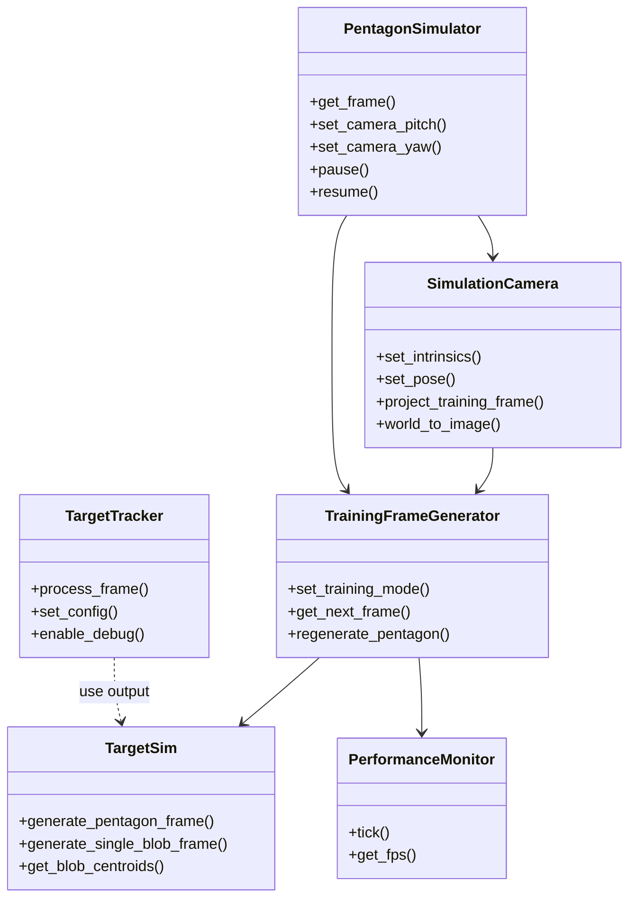

# Mygo 视觉项目技术总结

## 项目概述
本项目面向机甲杯赛事的视觉模块，围绕“目标靶子仿真 + 识别 + 位姿/角度解算 + 相机图传”构建了一条可复用的视觉技术链路。

## 核心技术要点
- 高解耦仿真架构：从靶子建模到流式图像生成，再到空间投影，均以独立类封装，便于复用和迁移。
- 识别算法迭代：从“全局色块比较”优化到“基于靶子形状特征的中心色块识别”，大幅降低比较复杂度。
- 多色彩空间融合：在 HSV/LAB/其他色彩空间之间设置权重，提升对黑色/深色/相近色误识别的鲁棒性。
- 3D 投影与相机内参：将平面仿真流投影到空间仿真图像，并使用厂商相机内参进行仿真相机初始化。
- 任务链路闭环：识别结果最终用于目标坐标到角度的解算，实现“感知 -> 计算 -> 输出”的完整链路。

## 关键模块与职责
- `TargetSim`：生成指定位置与旋转角度的标准靶子图像。
- `TrainingFrameGenerator`：流式图像生成器，基于时间戳和旋转速度函数驱动 `TargetSim` 生成仿真帧。
- `PerformanceMonitor`：统计帧率等性能指标，生成帧时调用 `tick` 自动更新。
- `TargetTracker`：输入相机图像（OpenCV `Mat`），输出目标色块位置。
- `PentagonSimulator`：封装靶子位置/相机位姿输入，输出实时空间仿真图像。

## 识别算法要点
1. 早期思路：对全图色块进行两两比较以寻找中心色块，复杂度高、效率不足。
2. 优化思路：利用靶子形状特征，将中心色块定位简化为少量比较。
3. 颜色相似度改进：引入 HSV 与 LAB 色彩空间，并按中心颜色取值自适应加权，提高鲁棒性。

## 3D 仿真与投影
- 实现仿真相机模型，将平面仿真流投影为 3D 空间图像。
- 使用厂商相机内参完成仿真相机初始化，提高空间映射真实性。

## 任务映射与可执行示例
```zsh
cd /home/usrname/Mygo/build/bin
ls
# 测试靶子生成：任务四
./test_basic

# 测试识别函数：任务三
./test_training

# 测试 3D 仿真：任务四
./pentagon_3d_perspective

# 应用识别算法到 3D 仿真：任务一
./pentagon_simulator_app

# 目标坐标到角度的解算：任务三
./camera_canvas_demo
```

## 构建与运行说明
### 依赖与环境
- CMake >= 3.14
- C++17 编译器
- OpenCV（模块：core, imgproc, highgui）

### CMake 配置参数
项目在顶层 `CMakeLists.txt` 中：
- 设置 C++ 标准为 17
- 启用 `CMAKE_EXPORT_COMPILE_COMMANDS` 便于 IDE 索引
- `find_package(OpenCV REQUIRED core imgproc highgui)`
- 可执行文件输出到 `build/bin`

### 本地构建
```zsh
mkdir -p build
cmake -S . -B build
cmake --build build -j
```

### 运行示例
```zsh
./build/bin/test_basic
./build/bin/test_training
./build/bin/pentagon_3d_perspective
./build/bin/pentagon_simulator_app
./build/bin/camera_canvas_demo
```

## 接口/类图与流程图
### 类图（核心模块）


### 流程图（仿真-识别-解算链路）


## 相机图传与部署平台
项目使用 MaixCam2 作为视觉硬件平台，结合 MaixVision IDE 进行调试。计划路线为：
- 以 C++/OpenCV 高性能识别为核心算法实现。
- 使用 MaixCDK 进行交叉编译，生成供 MaixPy 调用的 API。
- 以 Python 进行业务逻辑编排，提升研发效率。

## 架构优势与可迁移性
- 模块边界清晰，便于独立优化与移植。
- 仿真链路完整，可用来加速算法验证与性能评估。
- 识别与投影解耦，为后续接入官方接口或硬件优化留出空间。
